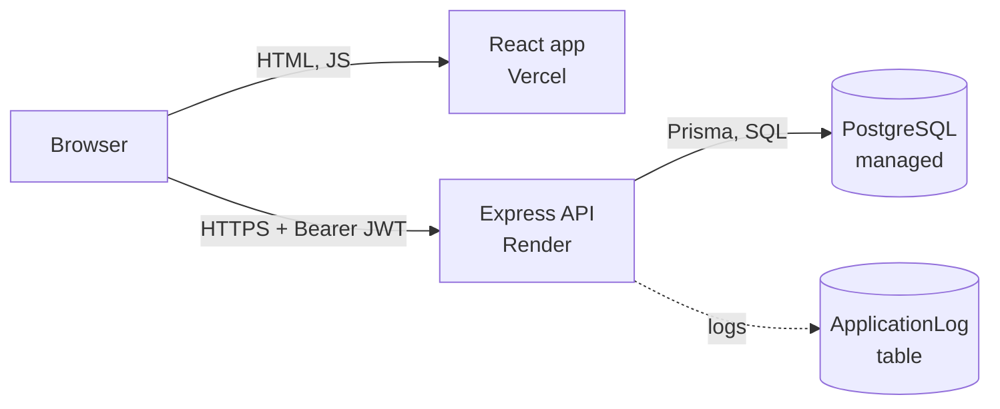
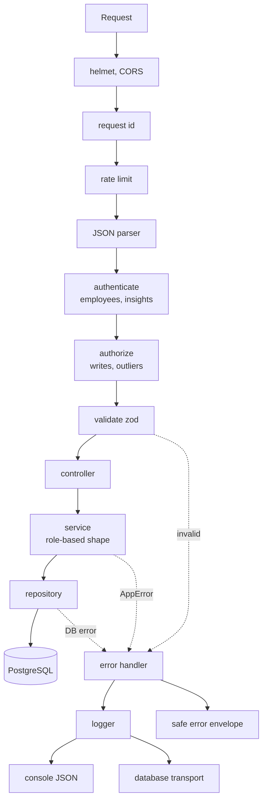
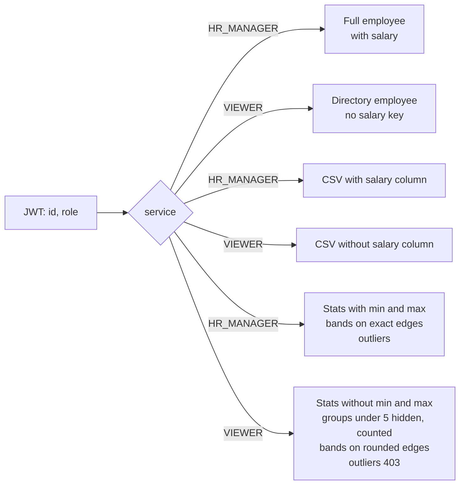
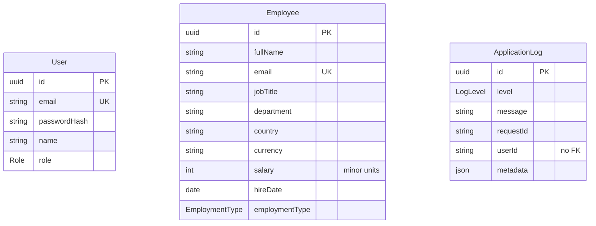
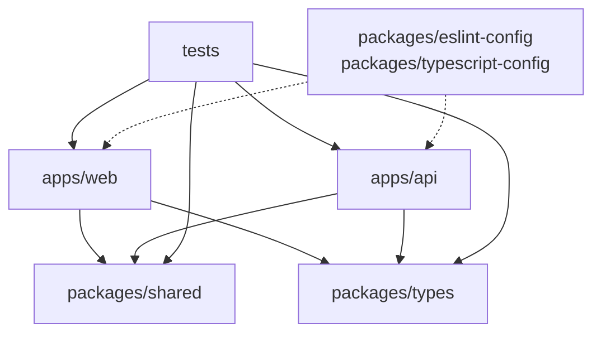

# Architecture

Diagrams for what is built. They use Mermaid, which GitHub renders. Reasons for each choice are in [design-notes.md](design-notes.md).

## 1. System overview

The browser loads the React app from Vercel and calls the Express API on Render directly. The API is the only thing that talks to PostgreSQL.



Locally the same three parts run with `pnpm dev` and `docker compose` (Postgres). The API allows only the web app's origin (CORS). Dashboard settings on Vercel and Render were not checked by me; see Known limitations in the design notes.

## 2. Backend request flow

Every request passes the same middleware, then a thin controller, a service that applies the role rules, and a repository. Any error goes to one handler.



`authorize` runs before `validate`, so a Viewer gets 403 before their input is examined. Auth routes are not behind `authenticate`; register and login have an extra limiter (10 per 15 minutes). The logger redacts passwords, tokens and headers once, before both outputs.

## 3. Role-based data flow

The service decides what leaves the server, from the role in the token. A controller never sees a raw row.



A Viewer who sorts or filters by salary gets a 400. The Viewer shape is built from an allowlist, so a new database column is not exposed by accident.

## 4. Data model

Three tables. There are no foreign keys: `ApplicationLog.userId` is a plain string so that logging never fails on a missing user.



Enums: Role (`HR_MANAGER`, `VIEWER`), EmploymentType, LogLevel. Employee has indexes on country, department, jobTitle, salary and (country, jobTitle), and a check that salary is not negative. Columns are shortened here; the full list is in `apps/api/prisma/schema.prisma`.

## 5. Monorepo layout

Apps never import each other. They share code only through `packages/*`. All tests live in `tests/`.



```text
apps/web        React: features/{landing,auth,employees,insights}, pages/
apps/api        Express: modules/{auth,employees,insights}, prisma/ (health route lives in app/routes.ts)
packages/       shared, types, eslint-config, typescript-config
tests/          api/{unit,integration,setup}, web, packages, helpers, factories, e2e (empty)
scripts/        test-location guard, production smoke check
docs/           requirements, design notes, architecture, AI prompts, demo script
```
